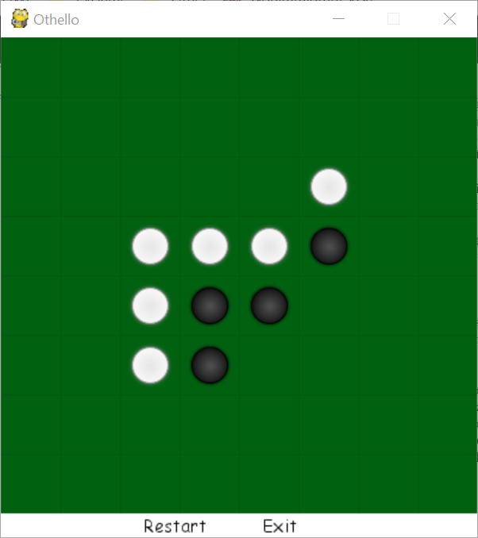

# Othello
credit to James.Qiu by email: jamesqiu@hku.hk

## An Screenshot of Game GUI

## Architecture

### Component One: Game Engine - main.py

Game engine handles all I/O events, repaints the board and manages games.

### Component Two: Game Logic Implementation

All game logic will be handled by othello.py.

### Component Three: Artificial Intelligence

Artificial intelligence algorithm will be implemented in this component.

## How to Run?

In Windows,

- Install python 3 (3.6.1 or above)
- Install pygame `py -m pip install pygame`
- Go to the root directory and run `py main.py`

In Linux,

- Check python version: `python3 --version`
- If not installed: `sudo apt-get install python3.6`
- Install pygame: `sudo apt-get install python3-pygame`
- Go to the root directory and run `python3 main.py`

